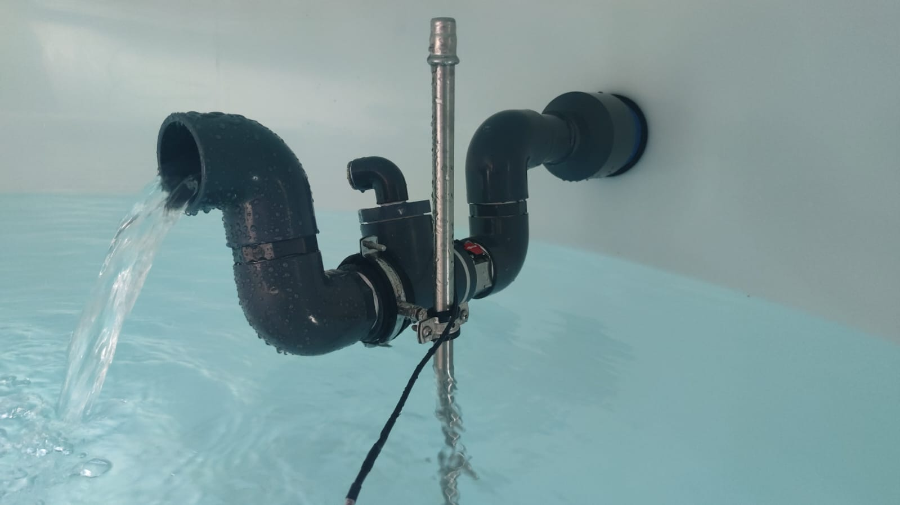
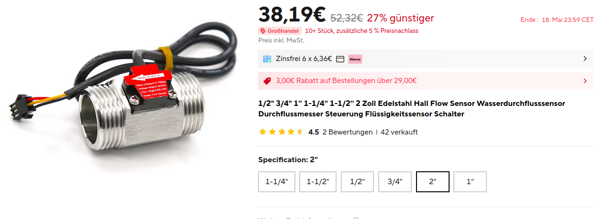
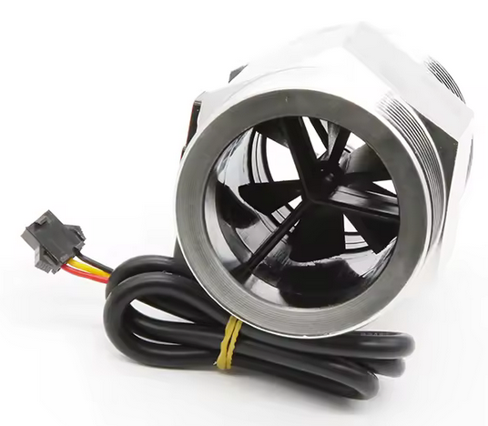
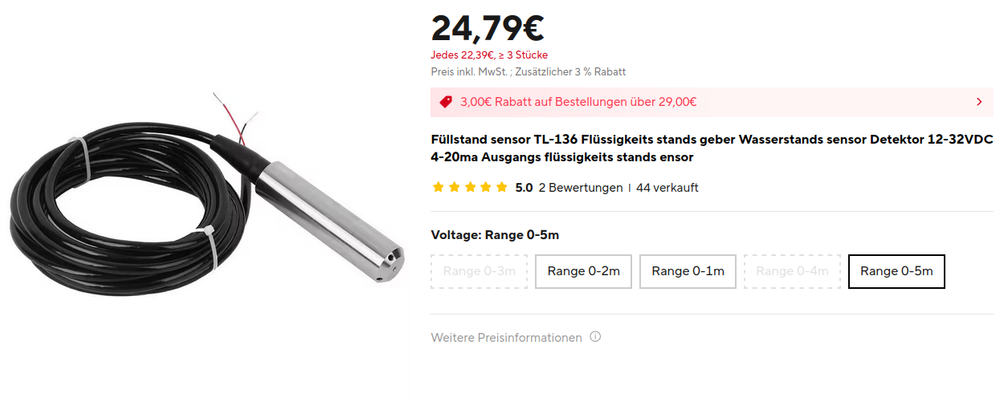
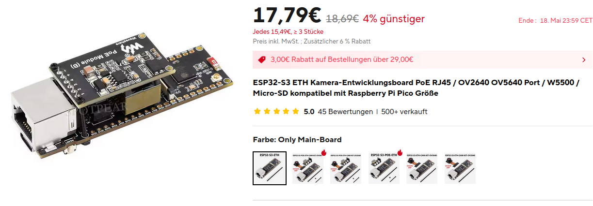

# Messung der Schüttung und des Wasserstandes der Quelle Bühl

Die Quelle liefert je nach Jahreszeit und Regenmenge unterschiedliche Wassermengen pro Stunde (Schüttung). Um einen Überbllick darüber zu bekommen und den zeitlichen Verlauf zu sehen wurden 2 Sensoren angebracht und die Messwerte in Homeassistant dargestellt. 
Ein ESP32-S3-ETH Microcontroller mit einem ESPHome Programm steuert diese beiden an und sendet die Messwerte über Ethernet. 
Um Batteriebetrieb oder eine zusätzliche Versorgungsleitung zu vermeiden, wird der ESP32-S3 direkt vom Netzwerkkabel ber POE (Power over Ethenet) versorgt.

https://github.com/vrees/dev/blob/master/spring-flow-sensor-eth/images/Video_Durchfluss-Aufbau.mp4

## Sensoren und ESP32-S3-ETH

### Durchflussmesser
Der Wasserdurchflusssensor besteht hauptsächlich aus einem Ventilkörper aus Messing, einer Wasserströmungsrotorbaugruppe und einem Hall-Sensor.Es wird am Wassereinlassende des Warmwasserbereiters installiert, um die Wasserdurchflussrate zu erkennen.Wenn das Wasser durch die Wasserflussrotorbaugruppe strömt, dreht sich der Magnetrotor und die Geschwindigkeit ändert sich mit der Durchflussrate.Der Hall-Sensor gibt das entsprechende Impulssignal aus und versorgt es zurück zum Controller.Das Gerät beurteilt die Größe des Wasserflusses und reguliert ihn.

[2 Zoll Wasserdurchflusssensor von Aliexpress](https://de.aliexpress.com/item/1005005590947529.html?spm=a2g0o.order_list.order_list_main.23.64fc5c5fTtG8rC&gatewayAdapt=glo2deu)

#### Spezifikationen:
- Temperatur: -25~+80
- Zulässiger Druck: Druck 1,75 MPa
- Betriebsfeuchtigkeitsbereich: 35 % ~ 90 % relative Luftfeuchtigkeit (kein Frost)
- Belastbarkeit: 10 mA (DC5V)
- Arbeitsspannungsbereich: DC5~18V
- Maximaler Betriebsstrom: 15 mA (DC 5 V)
- Die niedrigste Nennarbeitsspannung: DC 4,5 5V-24V
- Durchflussbereiche: 2“ 10–200 l/min
- 12 Impulse pro Liter Wasser
- Fehler ±5 %

#### Verkabelung:
- Red IN ist mit dem Pluspol verbunden
- Gelbe OUT-Signalausgangsleitung
- Schwarzer GND mit Minuspol verbinden

### Wasserhöhe
- Marke: Sensor TL-136
- Messbreich: 0-1m
- Messprinzip: 4-20mA, Spannung über einem 100 Ohm Widerstand mit einem ADC des ESP32-S3 gemessen 

[Füllstandssensor von AliExpress](https://www.aliexpress.com/p/order/index.html?spm=a2g0o.home.headerAcount.2.22e712e21IF8nH)

### ESP32-S3-ETH
ESP32-S3 Microcontroller mit Ethernet-Schnittstelle und POE-Zusatzboard. 
[ESP32-S3-ETH von AliExpress](https://de.aliexpress.com/item/1005007945002026.html?spm=a2g0o.order_list.order_list_main.79.64fc5c5fTtG8rC&gatewayAdapt=glo2deu)

### EspHome Programm

[siehe Github: spring-flow-sensor-eth.yaml](https://github.com/vrees/homeassistant/blob/master/esphome/spring-flow-sensor-eth.yaml)

